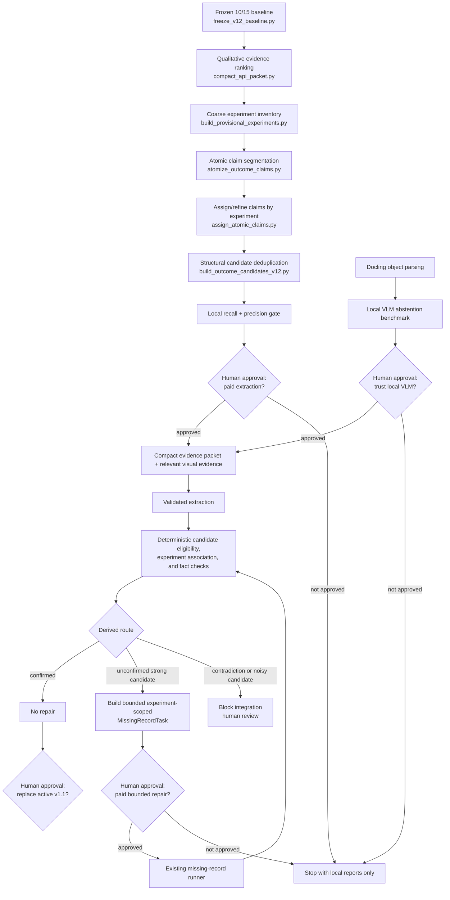

# v1.2 outcome-recall workflow

This workflow improves recall without exposing gold answers to extraction-time
code. Human approval is required at the three marked gates.

## Files introduced so far

| File | Function |
|---|---|
| `src/extraction/freeze_v12_baseline.py` | Freezes and verifies checksums for the current evaluator inputs and 10/15 result. |
| `reports/extraction/v12_baseline/baseline_manifest.json` | Immutable comparison snapshot used by the no-regression gate. |
| `data/annotations/heldout_v12/selection_manifest.json` | Empty, risk-stratified slots that only a human may populate with untouched papers. |
| `tests/fixtures/v12_text/qualitative_claims.json` | Permanent examples of qualitative and multi-relation claims. |
| `src/extraction/v12_structure_contracts.py` | Separates noun mentions, atomic relationships, and provisional experiments. |
| `src/extraction/build_provisional_experiments.py` | Builds a gold-blind coarse inventory from payload and experimental-context anchors. |
| `src/extraction/evaluate_provisional_experiments.py` | Separately checks whether known gold experiment groups were merged or missed. |
| `src/extraction/atomize_outcome_claims.py` | Splits mixed sentences and coordinated verbs into evidence-backed relationships. |
| `src/extraction/assign_atomic_claims.py` | Assigns claims to provisional experiments and abstains on unresolved context ties. |
| `src/extraction/build_atomic_candidates_v12.py` | Deduplicates by relationship structure instead of broad family or shared evidence ID. |
| `src/extraction/run_v12_atomic_inventory.py` | Materializes claims, diagnostics, candidates, and local manifests for all papers. |
| `src/extraction/evaluate_v12_atomic_inventory.py` | Measures one-to-one text recall by outcome type while deferring image-only gold to the visual track. |
| `src/extraction/select_atomic_candidates_v12.py` | Ranks and caps relationship-rich candidates; excluded rows remain in an audit file and are not sent. |
| `src/extraction/check_atomic_coverage_v12.py` | Matches selected candidates to saved outcomes one-to-one; shared evidence is only one part of the score. |
| `src/extraction/v12_visual_contracts.py` | Makes Docling provenance, atomic visual claims, and mandatory local-VLM abstention machine-validatable. |
| `src/extraction/run_v12_docling_visual.py` | Parses selected reconstructed crops locally and preserves the original PDF/page/object identity. |
| `tests/fixtures/v12_visual/benchmark_cases.json` | Permanently tests both visual misses plus adversarial queries that must abstain. |
| `src/extraction/benchmark_v12_gemma_visual.py` | Calls a model-scoped local Ollama VLM benchmark with the crop plus compact Docling context, enforces structured abstention, and audits exact values. |
| `src/extraction/build_v12_visual_focus.py` | Uses Docling OCR coordinates to crop only query-relevant panels while retaining parent-object provenance. |
| `src/extraction/build_v12_docling_candidates.py` | Converts numeric table row-column intersections into atomic candidates without a VLM. |
| `src/extraction/evaluate_v12_combined_recall.py` | Combines text and accepted visual candidates for development recall-by-type while keeping candidate yield distinct from precision. |
| `src/extraction/check_v12_visual_regressions.py` | Exits nonzero unless both visual positives and both adversarial abstention fixtures pass. |
| `src/extraction/promote_v12_vlm_claims.py` | Produces a gold-blind accepted-visual registry only after the complete VLM benchmark gate passes; deterministic table claims stay on the Docling route. |
| `src/extraction/v12_main_route.py` | Builds the compact recall-support envelope: provisional boundaries, atomic candidates, omitted cited evidence, deterministic Docling cells, and gated VLM claims. |
| `src/extraction/snapshot_v12_main_route.py` | Materializes checksummed support envelopes and token counts for human review before any paid rerun. |
| `src/extraction/preflight_compact_requests.py` | Builds the exact production request dictionaries, audits schema/evidence/gold-blindness, and submits them only to OpenAI's non-generating input-token endpoint before approval. |
| `src/extraction/run_compact_one_call.py` | Sends the v1.2 support envelope with the evidence packet, validates result citations against their union, and writes a gold-blind `v12_outcome_coverage.json` after each call. |
| `src/extraction/build_v12_precision_review.py` | Builds the post-rerun human review sheet for outcome support, experiment-link correctness, and critical-field precision. |
| `src/extraction/deterministic_coverage_v12.py` | Independently associates extracted experiments to provisional experiments, checks evidence and structural facts conjunctively, and derives safe routes without trusting model-authored labels. |
| `src/extraction/evaluate_candidate_eligibility_v12.py` | Measures the candidate gate against frozen positive/negative controls plus known gold-matched text candidates; it is evaluation-only and never enters extraction-time inputs. |
| `tests/fixtures/v12_candidate_eligibility/benchmark_cases.json` | Permanent direct-result, negative-result, speculative, method-only, and review-routing controls for candidate eligibility. |
| `tests/fixtures/v12_structural_coverage/gp004_broad_outcome.json` | Permanent regression proving that a broad hepatocyte outcome cannot cover the F4/80-positive Kupffer-cell result. |
| `src/extraction/backfill_v12_structural_coverage.py` | Recomputes deterministic structural reports for already stored responses without making API calls. |
| `src/extraction/build_v12_structural_repair_tasks.py` | Converts only strong unconfirmed candidates into capped `MissingRecordTask` files grouped by provisional experiment; contradictions and noisy candidates remain human review. |
| `src/extraction/prepare_v12_baseline_structural_tasks.py` | Verifies frozen-result, support, packet, and source-provenance checksums before building experiment-scoped tasks; it refuses to overwrite an existing audit trail. |
| `src/extraction/audit_v12_structural_tasks.py` | Recomputes the exact repair scope, validates every task checksum/fact/evidence/cap, rejects gold identifiers and duplicate scope, and proves accepted visual claims are accounted for. |
| `src/extraction/preflight_missing_record_repairs.py` | Persists the exact OpenAI request dictionaries and checks SDK keys plus every nested strict-schema object without sending a request. |
| `src/extraction/merge_v12_structural_repairs.py` | Revalidates checksums and recomputes deterministic fact coverage before any additive repair is merged; broad or unrelated recoveries fail closed. |
| `src/extraction/run_missing_record_repair.py` | Uses the existing binary recovered/unresolved contract with explicit candidate facts, medium reasoning, strict OpenAI schema conversion, and a mandatory CLI paid-call flag. |

## Visual routing rule

Docling receives only selected figure/table crops and returns OCR, layout, and
table structure. Numeric tables are converted deterministically from their
row-column intersections. For multipanel figures, the benchmarked local VLM
receives a focused panel crop plus a compact subset of the Docling structure.
Neither output is sent wholesale to the final extractor.
Only claims that pass schema validation, provenance audit, relevance selection,
and the mandatory-abstention gate may enter the compact evidence packet.

The default 8B Qwen3-VL tag resolves to the thinking checkpoint and is retained
as a rejected diagnostic. The direct-answer benchmark uses the distinct
`qwen3-vl:8b-instruct` digest. Model and inference-configuration results live in
separate artifact directories so failed runs cannot be overwritten.
A one-repeat run is only a screening check. Promotion requires all two positive
and two adversarial-abstention fixtures to pass in three repeats, including the
directional GO-018 relationship check; partial or one-repeat reports cannot
open the integration gate.

## Candidate rule

A cell, endpoint, or intervention mention alone is not an outcome candidate.
An atomic outcome candidate requires:

1. a subject;
2. an asserted predicate or relationship;
3. at least one object, endpoint, qualitative result, or numeric result; and
4. exact evidence provenance.

Endpoint, numeric value, and intervention context are useful but individually
optional. Missing details remain explicit and can route to review. One evidence
item may support several atomic claims, while each claim may be assigned to at
most one provisional experiment.

## Deterministic post-extraction rule

The legacy additive score remains available as an audit comparison, but it does
not decide which selected candidates enter structural coverage and it does not
authorize integration or repair. Every selected candidate is graded by the
structural checker, which requires an
independently computed experiment association, original evidence overlap, and
compatible atomic facts. A missing or broader cell population does not default
to agreement. Opposite polarity or incompatible numeric facts on an otherwise
matching identity block integration; they are not sent to the additive
missing-record repair path.

Only strong, measured, unconfirmed candidates may become bounded repair tasks.
Tasks are grouped by provisional experiment, contain at most 12 evidence items,
at most 8 candidate facts, and at most 8 returned outcomes. Gated visual claims
become atomic `route_hint=vision` candidates, so they cannot sit beside and
silently bypass structural coverage. Tasks are written and preflighted locally
before a human decides whether to pay for them. Task generation, structural
backfill, eligibility evaluation, auditing, and preflight all report
`paid_api_requests: 0`.

## Current paid-call approval checkpoint

The authoritative prepared set is
`data/staging/extraction/v12_structural_primary_v6`. The permanent audit is
`reports/extraction/v12_structural_primary_v6/task_audit.json`; it passes with
no issues. Exact unsent request payloads are stored under
`data/staging/extraction/v12_structural_primary_v6_preflight`, with their hashes
and validation report in
`reports/extraction/v12_structural_primary_v6/request_preflight.json`.

There are 12 bounded calls, four per paper—not three full-paper calls. The
increase is required because every selected candidate is now graded
structurally; the old similarity filter had incorrectly removed the explicit
GP-004 serum ALT candidate as “already covered.” The 12 requests cover 66
repair candidates and have a conservative combined input upper bound of 44,645
tokens. No server request or paid extraction call has been made. Human approval
is required before running any of them.
